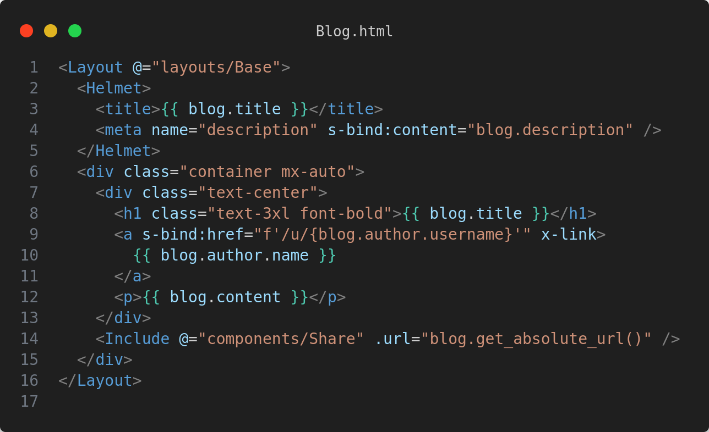

# Picomet


[](https://pypi.org/project/picomet)


[](https://discord.gg/4byApQZg8X)

## Introduction

Picomet allows you to build Single Page Applications (SPAs) with Server-Side Rendering (SSR) capabilities, seamlessly integrated with Django. What sets this framework apart is its ability to update any specific part of a page by partially rendering it on the server and to render Alpinejs syntax on the server.

## Features

-   🏚️ Single page app
-   🔎 Partial rendering
-   🏯 Nested layout
-   ☎️ Server action
-   ⚡ Hot module reload
-   🌲 Alpinejs support
-   🖌️ Tailwind support
-   ✨ Copier starter



## Installation

Get [uv](https://docs.astral.sh/uv) from **Astral**

```bash
uvx --with copier -p 3.12 picomet startproject my-project
```

## Getting Started

Go to [picomet.readthedocs.io](https://picomet.readthedocs.io) for getting started

> **Tip** : Picomet isn't stable at this moment. Stability is expected with the 1.0.0 release. Remember to update **picomet** from time to time, to get the latest features and bug fixes.

## Contribution Guideline

We welcome contributions from the community to enhance and improve the framework. If you'd like to contribute, please read [CONTRIBUTING.md](CONTRIBUTING.md).

## License

Picomet is licensed under the **MIT License**. Feel free to use it in your projects and make it even better!

## Support

If you have any questions, issues, or feature requests, please open an issue or create a discussion on GitHub. We appreciate your feedback!

Happy coding! 🚀
